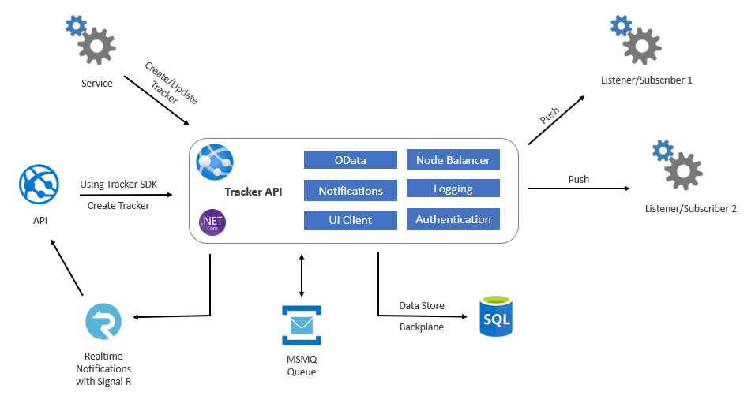

# TrackerApi
a tracking, notifications api and sdk with service bus implemenation for managing state between distributed services, queue's architecture



## Summary


### Issue

We want to have schedular services to perform specific functionality on timely basis with some of those details -
These services needs to run in background and straigh forward solution is to use .Net Console application and host using Task Schedular. However, below are some of the issues list which  wanted to have a soltion -

  * In distributed architecture creating services for each and every new funtionality and maintaining across different environment is time confusing.
  
  * There needs to be a common solution to these type of background processes to run on even driven architecture and setup with minimal efforts.

  * We want developer experience to be fast and reliable, for the setup they should not worry about what Messaging queue is getting used, tracking the messages, logging and monitoring.


### Features

All the usual devops assumptions, such as in the book Accelerate.

  * The Tracker API and SDK has used on Dotnet Core 3.1 for App Development, MSMQ for Queue and SQL for data storage and Queue backplane
  * Different application can consume Tracker SDK or can call over REST OData API to create/update/view trackers. Even they can use API to retrigger tracker incase of failure scenarios.
  * Tracker API also have notification support for general as well as for trackers
  * Application can subscribe to Tracker API notification channel to received Realtime notification updates
  * Tracker API can use Memory Cache or Redis cache for caching
  * The design uses MSMQ as Queue. However, any other pub-sub provider Queue can be used like Rabbit Queue, AWS SNS or Azure Topics
  * The design uses  as Signal R. However, any other Realtime messaging provider can be used

## Usage

```csharp
var tracker = new Tracker("tracking api url", QueueHandler);
tracker.CreateAsync(new TrackerRequest());
```

```csharp
var notification = new Notification("tracking api url");
notification.CreateAsync(new Notification());
```
